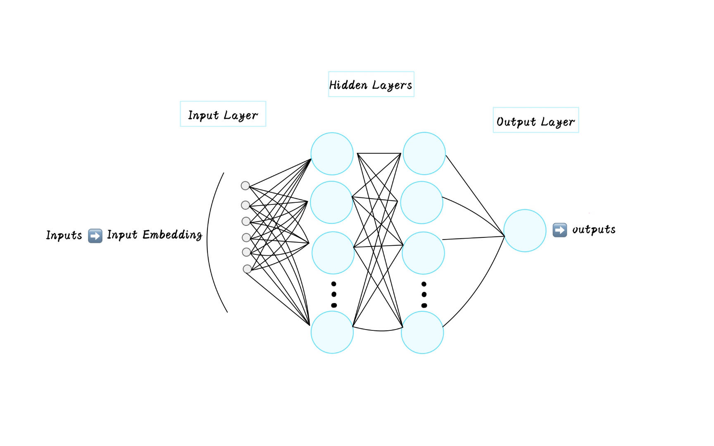

## Understanding Text Classification ##

Text classification, a form of supervised learning, categorizes text into predefined groups based on labeled data. It's a crucial technique used across various domains including spam detection, sentiment analysis, and topic categorization.In this post, we'll focus on classifying disaster-related tweets using a neural network model built with PyTorch.

---

## Why Use Text Classification ##

Text classification facilitates efficient organization and management of large text datasets, empowering businesses to automate data analysis and extract valuable insights for informed decision-making. Common applications include:

+ Spam Detection: Automatically identifying and filtering spam emails


+ Sentiment Analysis: Analyzing customer feedback and social media posts to determine sentiment.


+ Topic Categorization: Classifying news articles, research papers, or documents into specific topics.

## Steps in Text Classificaiton ##

1. **Data Collection**
The first step is to gather a labeled dataset. This dataset should contain text samples and their corresponding categories.


2. **Text Preprocessing**
Clean and prepare the text data for analysis.This involves:
+ Converting Text to Lowercase: Standardizing the text to lower case.


+ Tokenization: Splitting the text into individual words or tokens.


+ Removing Special Characters and Punctuation: Ensuring that only meaningful characters are retained.


+ Removing Stop Words: Removing common words that do not add much value (e.g., "and", "the").


+ Removing something,Replace by keyword: Removing URLs,replace by 'URL',Removing HTML beacons,replace by 'html',Removing numbers,replace by 'number',Removing emojis,replace by 'emoji'


3. **Feature Extraction**
Transform the text into numerical features that machine learning models can process. Common methods are:
+ Bag of Words(BoW)


+ Term Frequency-Inverse Document Frequency (TF-IDF)


+ Word Embeddings (Word2Vec, GloVe)


+ Contextual Embeddings (BERT, GPT)


4. **Model Selection**
Select an appropriate machine learning model for classification. Popular choices include:
+ Naive Bayes


+ Support Vector Machines (SVM)


+ Logistic Regression


+ Deep Learning Models (RNN, CNN, Transformer-based models)


5. **Model Training**
Train the chosen model using the training dataset.


6. **Model Evaluation**
Evaluate the model's performance using metrics like accuracy, precision, recall, and F1 score.


7. **Hyperparameter Tuning**
Optimize the model by adjusting hyperparameters to enhance performance.

## Example: Text Classification for Disaster Tweets ##
Below is an example of a text classification model for disaster tweets using PyTorch:



```python
import torch
import torch.nn as nn
import torch.nn.functional as F

class TextClassifier(nn.Module):
    def __init__(self, vocab_size, embedding_dim, hidden_dim, output_dim):
        super(TextClassifier, self).__init__()
        self.embedding = nn.Embedding(vocab_size, embedding_dim)
        self.fc = nn.Linear(embedding_dim, hidden_dim)
        self.fc2= nn.Linear(hidden_dim,hidden_dim)
        self.fc3 = nn.Linear(hidden_dim, output_dim)
        self.dropout = nn.Dropout(0.85)

    def forward(self, text):
        embedded = self.embedding(text)
        embedded = embedded.mean(1)  # Assume averaging the embeddings is the feature
        hidden = self.dropout(F.relu(self.fc(embedded)))
        output = self.fc2(hidden)
        output=self.fc3(output)
        return output
    
# Hyperparameters
vocab_size = len(vocab)+1  # Size of your vocabulary
embedding_dim = 256
hidden_dim = 256
output_dim = 1  # Binary classification
learning_rate = 0.001
batch_size = 32
num_epochs = 10
```

## Explanation of the Model ##
+ Embedding Layer: Converts input words into dense vectors of fixed size (embeddings).


+ Fully Connected Layers: The first fully connected layer transforms the embeddings into a hidden dimension. The second fully connected layer further processes these hidden representations, and the final layer outputs the classification result.


+ Dropout Layer: Helps prevent overfitting by randomly setting a fraction of input units to 0 at each update during training.

## Conclusion ##
Text classification is a powerful technique for automating the categorization of text data. By following the outlined steps, you can develop and deploy effective text classification models. This method is versatile, serving a wide range of text processing tasks such as spam detection, sentiment analysis, and topic categorization, offering robust and efficient solutions for various applications.
